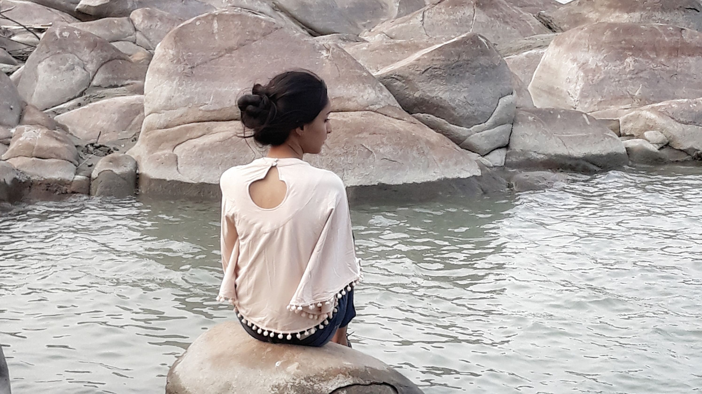

“The future belongs to those who believe in the beauty of their dreams.” —Eleanor Roosevelt

My name is **Khushboo Goswami**. I am a final year agricutural engineering student. I like to scribble around and share things here. I believe you deserve happiness, respect, and love. And I’m determined to give you the tools to create those feelings in every crevice and cranny of your existence.

**Q** - What's the one word that describes me? 
**A** - Imperturbable

**Q** - Why do I blog? 
**A** - I am a hobbist writer. This is a simple creative outlet, in hopes of building an online community. 

**Q** - Who do I follow the most? 
**A** - Taylor Swift ,Sushmita Sen, MS Dhoni, Paulo Coelho

**Q** - Song that's currently playing in my head? 
**A** - "Look what you made me do" - Taylor Swift